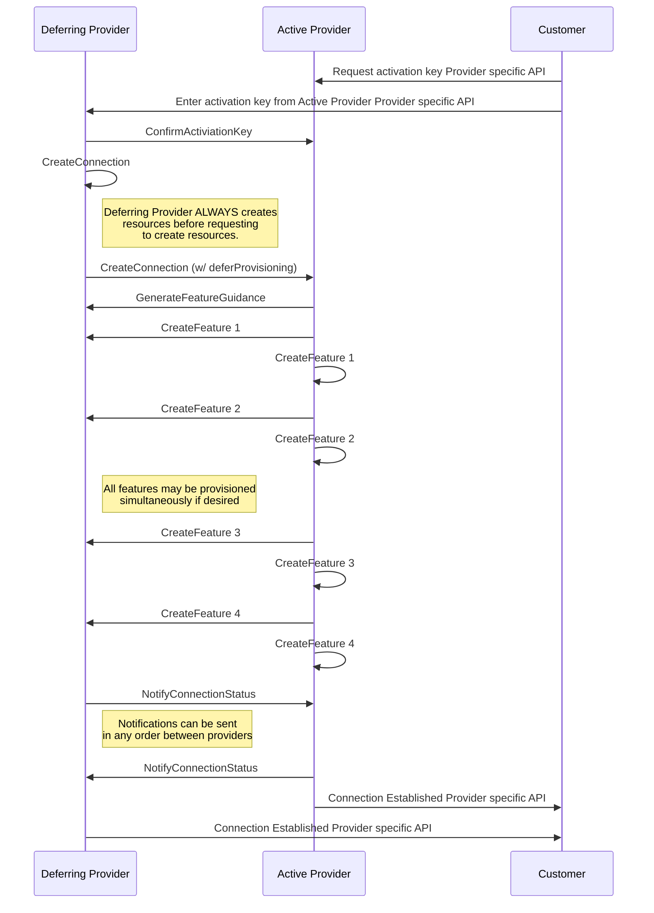
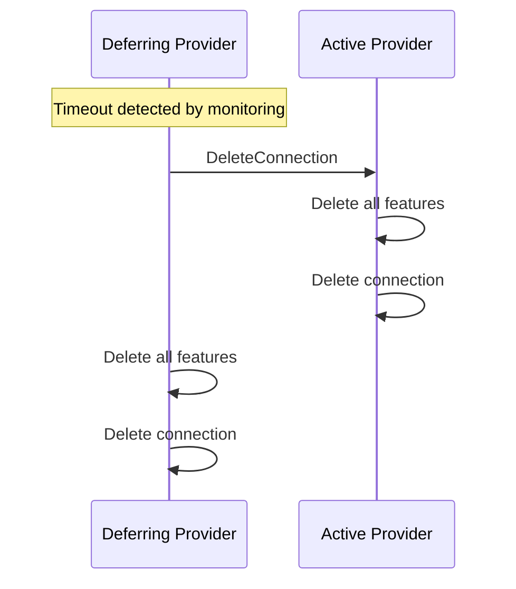

# **Multi-Cloud Connection Deferral Design**

This document outlines the design for a provider-to-provider handover mechanism
within the Connection Coordinator API specification. This mechanism allows an
initial "Active Provider" to defer the responsibility of driving the connection
creation flow to a "Passive Provider" via a new Defer Connection Flow.

## **Defer Connection Flow**

### **1\. Environment Resource Attributes**

The following environment attributes control the deferral behavior for an active
provider.

| Field | Type | Description |
| :---- | :---- | :---- |
| `deferralTimeoutHours` | `int32` | The number of hours the deferring provider will wait for the remote provider to finalize the connection before declaring a failure. |
| `deferConnectionProvisioning` | `bool` | Indicates that the active provider should always defer connections to the passive provider in this environment |

### **2\. Connection Resource Attributes**

The following connection attribute allows for deferral during the initial
creation of the connection.

| Field | Type | Description |
| :---- | :---- | :---- |
| `deferProvisioning` | `bool` | When set to true during a CreateConnection request, this indicates that the caller is deferring active provisioning responsibilities to the receiver. |

## **Execution Flow**

### **Phase 1: Local Resource Preparation**

The provider seeking to defer (the "Deferring Provider") must first ensure local
consistency.

* **Local Creation**: The Deferring Provider MUST create a Connection resource
locally before calling the deferral API. This resource serves as the source of
truth for monitoring the handover progress.
* **State Tracking**: The local Connection resource is initialized in a
`PENDING` state with a `VerificationStatus` of `UNVERIFIED`.

### **Phase 2: Handover**

* **CreateConnection**: By setting the `deferConnection` flag to `true`
        when calling `CreateConnection` on the remote provider.
* **Acknowledgement**: The remote provider validates the request against its own
local Environment and accepts responsibility for driving the remaining
provisioning steps in the background.

### **Phase 3: Monitoring and Timeout**

* **Active Monitoring**: The Deferring Provider monitors the local Connection
resource. Failure is determined if the resource does not transition to a
`FINALIZED` or `ACTIVE` state within the timeframe specified by the
`deferralTimeoutHours` field in the Environment object.
* **Success Criteria**: The flow is considered successful once the remote
provider calls `NotifyConnectionStatus` or the connection is marked as verified.

## **Rollback and Failure Handling**

If the `deferralTimeoutHours` threshold is reached without a successful state
transition, the Deferring Provider initiates a rollback to prevent resource
leaks and billing discrepancies.

### **Rollback Steps**

1. **Detection**: The monitoring service identifies a timeout on the local
   Connection resource.
2. **Cancel Creation**: The Deferring Provider calls `DeleteConnection` on the
   remote provider to cancel any partial provisioning on the remote side.
3. **Local Cleanup**: The Deferring Provider deletes the local Connection and
   associated ephemeral resources (e.g., Tenant Project components or
   Cloud Routers).
4. **Notification**: The system generates an error log for the customer,
   indicating that the multi-cloud connection failed to establish within
   the expected window.

